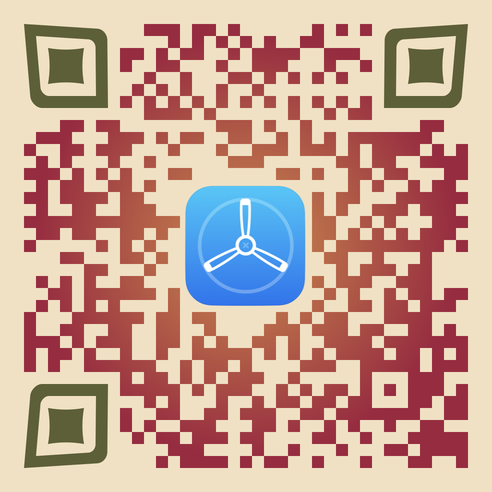
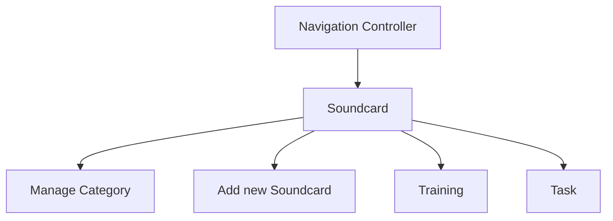

# Oalla
A native iOS App that enhance user’s communication skill for ASD patients in their early ages by take input from the camera and can recognise the object and output the object name as text and voice which can also be saved as a personal dictionary of common used things. This is a solution to the challenge because ASD patient put more attention to visual than literal so AAC(Augmentative and Alternative Communication) method is more efficient  to implemented because it use symbols, selection techniques, and strategies to enhance communication.

## Get this app

[TestFlight](google.com)

## Feature
### Soundcard
This is the main feature of this app. this feature consist of Soundcard and category management
  - Preinstalled Category with their own set of soundcard.
  - Easy to manage category.
  - Tap to play soundcard.
  - Add new soundcard enhanced with Machine Learning to determine the object.
 
### Training
This feature to help the user to train their communication by asking them random simple question that connected to the soundcard.

### Task
Consist of 2 part "Daily Task" and "Achievement" that help to motivate the user to use the apps.

## Storyboard

## Main Technology used
  - Navigation controller
  - UIViewController
  - CollectionView
  - UserDefault
  - CoreData
  - AVFoundation
  - Segue
  - TableView
  - Autolayout

## Created by - M2-911 
  - [Isti](https://gitlab.com/Strooberi)
  - [Rizal](https://gitlab.com/rizalhidayat)
  - [Sw](https://gitlab.com/swrhythm95)
  - [Taufiq](https://gitlab.com/taufiq.rama)
  - [Tony](https://gitlab.com/tonyoditanto)

## Mentored by 
  - [Jaya Pranata](https://gitlab.com/jaya.pranata)